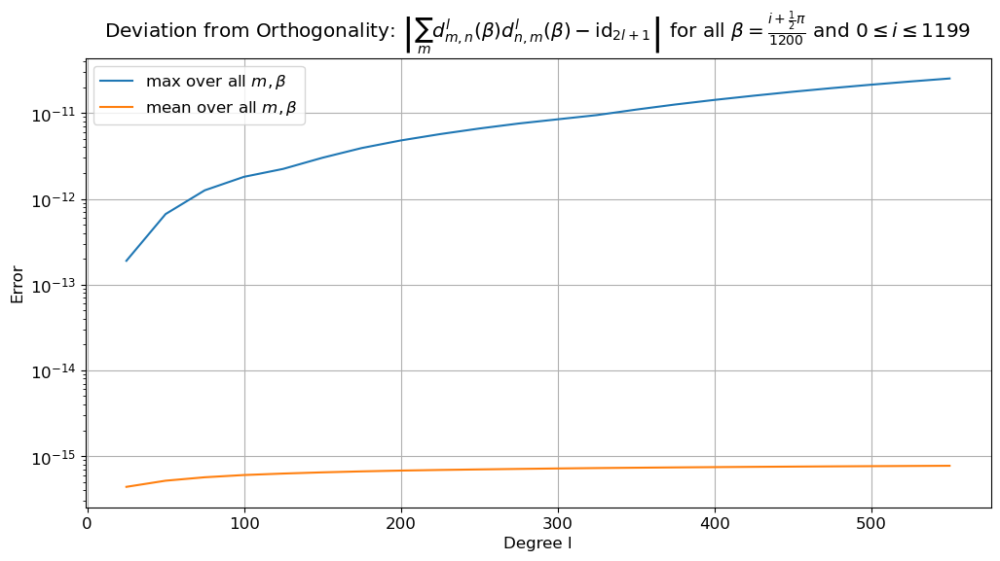
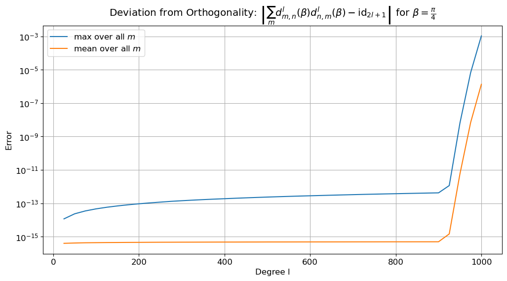
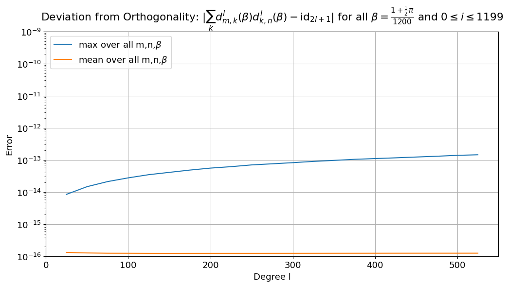
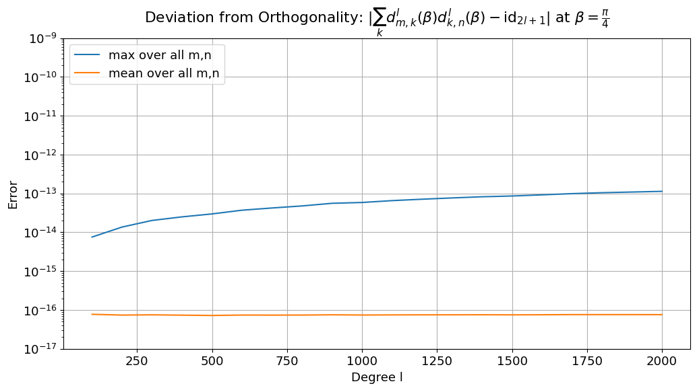

# Accuracy

The critical part of PySOFT in terms of numerical accuracy is the computation of Wigner d matrices.
Here we use the fact that Wigner should be orthogonal to verify the correctness of their computation.

## Kostelec recurence
By default PySOFFT uses [three-term recursion proposed by Kostelec](defs/wigner.md#kostelec-recurrence) to compute the wigner d matrices. Its numericall accuracy has been verified, until a bandwidth of `bw=600` at all transform relevant angels $\beta$.

{width = 300}


/// warning | Issues for `bw>600`
For degrees/bandwidth higher that 600 and certain $\beta$ values the Kostelec recurrence breakes down, e.g. for 
$\beta =\frac{\pi}{4}$ and $l>800$:  

{width = 300}
///

## Risbo recurrence

[Risbos recurrence scheme](defs/wigner.md#risbo-recurrence) has also been tested until a bandwidth of `bw=60`to compute the wigner d matrices. Its numericall accuracy has been verified, until a bandwidth of `bw=600` for transform relevant angles $\beta$.

{width = 300}

/// Example | Code
This will take a loong time to compute ...
```py
from pysofft import wigner as wig
from pysofft import utils
import numpy as np
from datetime import datetime as dt

betas = wig.create_beta_samples(1200)
cos_beta = np.cos(betas/2)
sin_beta = np.sin(betas/2)

L=600
sqrts = np.sqrt(np.arange(2*L-1))
ddl = np.zeros((len(betas),1),dtype=float)
prec_max = []
prec_mean = []
ls = []
for l in range(L+1):
    #dl = wig.wigner_mn_recurrence_risbo(dl,l,cos_beta,sin_beta,sqrts)
    ddl = wig.wigner_recurrence_risbo_reduced(ddl,l,cos_beta,sin_beta,sqrts,False)
    if l%25==0:
        ls.append(l)
        dl = wig.sym_reduced_to_full_wigner(ddl,l)
        #ddl = dl[nb].copy().reshape(2*l+1,2*l+1) #* np.sqrt((2*l+1)/2)
        dlt = np.swapaxes(dl,1,2)
        abs_diff = np.abs(dl@dlt-np.eye(2*l+1))
        prec_max.append(abs_diff.max())
        prec_mean.append(np.mean(abs_diff))
        np.save('prec_max_risbo.npy',prec_max)
        np.save('prec_mean_risbo.npy',prec_mean)
        print(f'{str(dt.now())} : l={l} done!')
```
///

and does not seem to suffer from stability loss at high bandwidths, but it is quite a bit worse in terms of [transform speed](speed.md).

{width = 300}

/// Example | Code
```py
from pysofft import wigner as wig
from pysofft import utils
import numpy as np
from datetime import datetime as dt

betas = np.array([np.pi/4,np.pi-np.pi/4])
cos_beta = np.cos(betas/2)
sin_beta = np.sin(betas/2)

L=3000
sqrts = np.sqrt(np.arange(2*L-1))
ddl = np.zeros((len(betas),1),dtype=float)
prec_max = []
prec_mean = []
ls = []
for l in range(L+1):
    #dl = wig.wigner_mn_recurrence_risbo(dl,l,cos_beta,sin_beta,sqrts)
    ddl = wig.wigner_recurrence_risbo_reduced(ddl,l,cos_beta,sin_beta,sqrts,False)
    if l%100==0:
        ls.append(l)
        dl = wig.sym_reduced_to_full_wigner(ddl,l)[0]
        abs_diff = np.abs(dl@dl.T-np.eye(2*l+1))
        prec_max.append(abs_diff.max())
        prec_mean.append(np.mean(abs_diff))
        np.save('prec_max_risbo_break.npy',prec_max)
        np.save('prec_mean_risbo_break.npy',prec_mean)
        print(f'{str(dt.now())} : l={l} done!')
```
///
