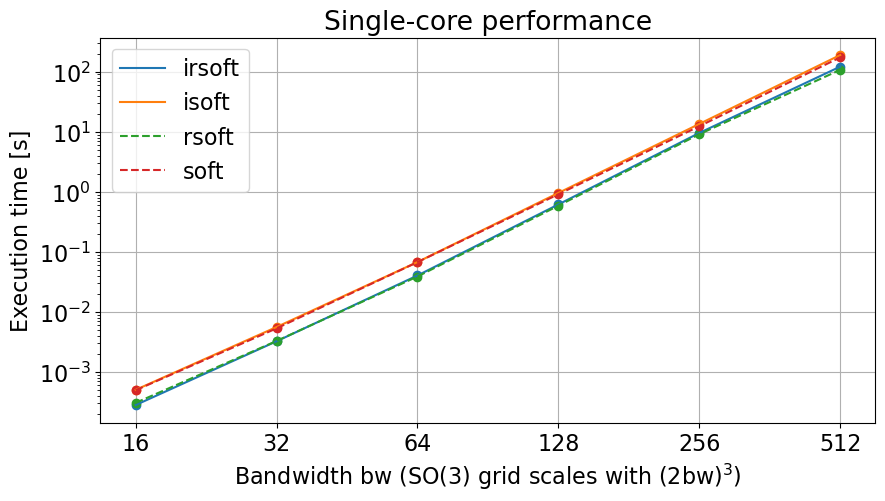
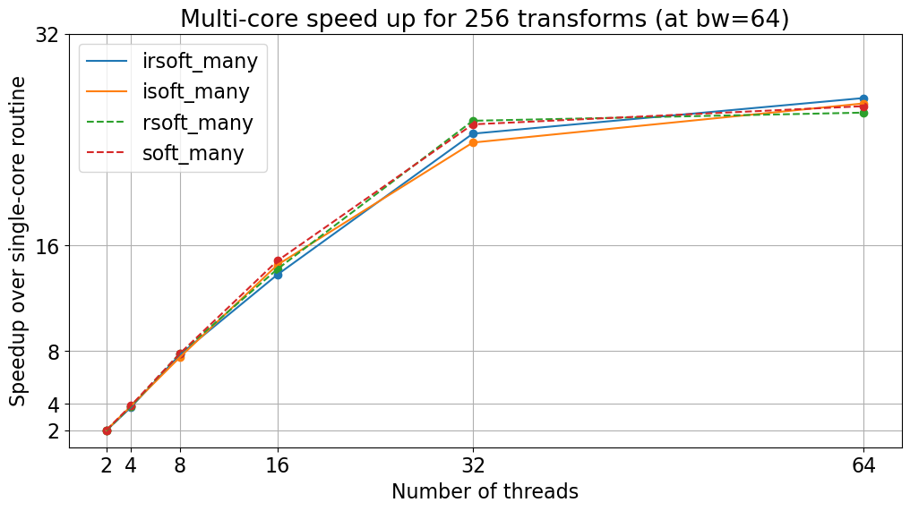
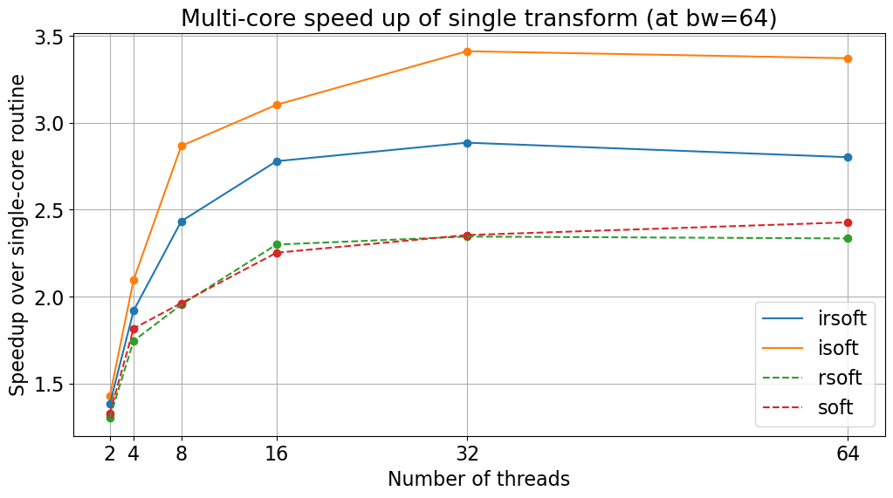

# Performance metrics
The following performence metric where generated on a compute node with two AMD EPYC 7543 with a total of 64 physical CPU cores and 512GB of RAM.


<figure markdown="span">
	{ width="700" }
</figure>


| method\\bw | 16                     | 32                      | 64                     | 128                     | 256                    | 512                 |
|------------|------------------------|-------------------------|------------------------|-------------------------|------------------------|---------------------|
| soft       | $500\mu$s $\pm 10\mu$s | $5.346$ms $\pm 0.01$ms  | $67.7$ms $\pm 0.2$ms   | $0.9139$s $\pm 0.0008$s | $12.396$s $\pm 0.3$s   | $173.4$s $\pm 0.8$s |
| isoft      | $506\mu$s $\pm 5\mu$s  | $5.63$ms $\pm 0.02$ms   | $67.94$ms $\pm 0.07$ms | $0.960$s $\pm 0.001$s   | $13.529$s $\pm 0.004$s | $189.9$s $\pm 0.3$s |
| rsoft      | $307\mu$s $\pm 3\mu$s  | $3.295$ms $\pm 0.007$ms | $39.0$ms $\pm 0.2$ms   | $0.5887$s $\pm 0.0001$s | $9.126$s $\pm 0.007$s  | $107.6$s $\pm 0.9$s |
| irsoft     | $283\mu$s $\pm6\mu$s   | $3.258$ms $\pm 0.004$ms | $40.6$ms $\pm 0.3$ms   | $0.6181$s $\pm 0.0003$s | $9.582$s $\pm 0.002$s  | $121.7$s $\pm 0.1$s |

The given errors are simply the standard deviations of the above computed datasets.
/// note | Code: Single-core speed test
WARNING: The bw=512 computation uses $\sim 70$GB of RAM and bw=256 uses $\sim 8$GB. Depending on your PC you might need to skip these.
``` py
from pysofft import Soft
import pysofft
import timeit
import numpy as np
    
soft_execution_times=[]
rsoft_execution_times=[]
isoft_execution_times=[]
irsoft_execution_times=[]
for bw in [16,32,64,128,256,512]:
	# instanciating Soft class + generating in/out arrays
	s = Soft(bw,init_ffts=True,enable_fftw_wisdom=True,fftw_flags=pysofft._soft.softclass.fftw_measure,precompute_wigners=False)
	coeff = s.get_coeff(random=True)
	coeffr = s.get_coeff(random=True,real=True)
	func = s.get_so3func()
	funcr = s.get_so3func(real=True)
	
	# speed tests
	tmpi = np.array(timeit.repeat('s.isoft(coeff,out = func)',number=10,repeat=7,globals=globals()))/10
	isoft_execution_times.append(tmpi)
	tmpir = np.array(timeit.repeat('s.irsoft(coeffr, out = funcr)',number=10,repeat=7,globals=globals()))/10
	irsoft_execution_times.append(tmpir)
	tmp = np.array(timeit.repeat('s.soft(func,out = coeff)',number=10,repeat=7,globals=globals()))/10
	soft_execution_times.append(tmp)
	tmpr = np.array(timeit.repeat('s.rsoft(funcr, out = coeffr)',number=10,repeat=7,globals=globals()))/10
	rsoft_execution_times.append(tmpr)
soft_mean = np.mean(soft_execution_times,axis=-1)
rsoft_mean = np.mean(rsoft_execution_times,axis=-1)
isoft_mean = np.mean(isoft_execution_times,axis=-1)
irsoft_mean = np.mean(irsoft_execution_times,axis=-1)
```
///

	
	
## Memory consumption
The memory consumption (in Byte) of individual transforms roughly scales with 

$$
  64 (2\ \mathrm{bw})^3
$$

Note that $(2\ \mathrm{bw})^3$ is the number of SO(3) grid points for a given bandwidth.
In paticular this is much lower than the number of Wigner-D matrix elements involvend in the trasform, which scales with
$O(\mathrm{bw}^4)$.


## Multi-core performance
PySOFFT allows parallelization in two different ways:  
 1. Compute transforms for many datasets in parallel.  
 2. Speed up individual transforms (Currently no parallel executions of the FFT part)  


<figure markdown="span">
	{ width="700" }
</figure>


| method\\threads | 2   | 4   | 8   | 16 | 32 | 64 |
|-----------------|-----|-----|-----|----|----|----|
| soft            | 2.0 | 3.9 | 7.8 | 15 | 25 | 27 |
| isoft           | 2.0 | 3.8 | 7.5 | 15 | 24 | 28 |
| rsoft           | 2.0 | 3.8 | 7.8 | 14 | 25 | 26 |
| irsoft          | 2.0 | 3.7 | 7.7 | 14 | 24 | 27 |


/// note | Code: Multi-core multi-transform speed test
``` py
import pysofft
from pysofft import Soft
import timeit
import numpy as np

soft_execution_times=[]
rsoft_execution_times=[]
isoft_execution_times=[]
irsoft_execution_times=[]
bw = 64
N = 256
for nthreads in [1,2,4,8,16,32,64]:
	# instanciating Soft class + generating in/out arrays
	s = Soft(bw,init_ffts=True,enable_fftw_wisdom=True,fftw_flags=pysofft._soft.softclass.fftw_measure,precompute_wigners=False)
	pysofft.OMP_set_num_threads(nthreads)
	coeff = s.get_coeff(random=True,howmany=N)
	coeffr = s.get_coeff(random=True,real=True,howmany=N)
	func = s.get_so3func(howmany=N)
	funcr = s.get_so3func(real=True,howmany=N)

    
	tmp = np.array(timeit.repeat('s.isoft_many(coeff,out = func,use_mp=True)',number=10,repeat=1,globals=globals()))/10
	isoft_execution_times.append(tmp)
	tmpr = np.array(timeit.repeat('s.irsoft_many(coeffr, out = funcr,use_mp=True)',number=10,repeat=1,globals=globals()))/10
	irsoft_execution_times.append(tmpr)
	tmp = np.array(timeit.repeat('s.soft_many(func,out = coeff,use_mp=True)',number=10,repeat=1,globals=globals()))/10
	soft_execution_times.append(tmp)
	tmpr = np.array(timeit.repeat('s.rsoft_many(funcr, out = coeffr,use_mp=True)',number=10,repeat=1,globals=globals()))/10
	rsoft_execution_times.append(tmpr)
soft_mean = np.mean(soft_execution_times,axis=-1)
rsoft_mean = np.mean(rsoft_execution_times,axis=-1)
isoft_mean = np.mean(isoft_execution_times,axis=-1)
irsoft_mean = np.mean(irsoft_execution_times,axis=-1)

soft_speedup = soft_mean[0]/soft_mean[1:]
rsoft_speedup = rsoft_mean[0]/rsoft_mean[1:]
isoft_speedup = isoft_mean[0]/isoft_mean[1:]
irsoft_speedup = rsoft_mean[0]/irsoft_mean[1:]
```
///

<figure markdown="span">
	{ width="700" }
</figure>


| method\\threads | 2   | 4   | 8   | 16  | 32  | 64  |
|-----------------|-----|-----|-----|-----|-----|-----|
| soft            | 1.3 | 1.8 | 2.0 | 2.3 | 2.4 | 2.4 |
| isoft           | 1.4 | 2.1 | 2.9 | 3.1 | 3.4 | 3.4 |
| rsoft           | 1.3 | 1.7 | 2.0 | 2.3 | 2.3 | 2.3 |
| irsoft          | 1.3 | 1.9 | 2.4 | 2.8 | 2.9 | 2.8 |


/// note |Code: Multi-core single-transform speed test
``` py
import pysofft
from pysofft import Soft
import timeit
import numpy as np
    
soft_execution_times=[]
rsoft_execution_times=[]
isoft_execution_times=[]
irsoft_execution_times=[]
bw = 64
for nthreads in [1,2,4,8,16,32,64]:
	# instanciating Soft class + generating in/out arrays
	s = Soft(bw,init_ffts=True,enable_fftw_wisdom=True,fftw_flags=pysofft._soft.softclass.fftw_measure,precompute_wigners=False)
	pysofft.OMP_set_num_threads(nthreads)
	coeff = s.get_coeff(random=True)
	coeffr = s.get_coeff(random=True,real=True)
	func = s.get_so3func()
	funcr = s.get_so3func(real=True)
    
	# speed tests
	tmp = np.array(timeit.repeat('s.isoft(coeff,out = func,use_mp=True)',number=10,repeat=7,globals=globals()))/10
	isoft_execution_times.append(tmp)
	tmpr = np.array(timeit.repeat('s.irsoft(coeffr, out = funcr,use_mp=True)',number=10,repeat=7,globals=globals()))/10
	irsoft_execution_times.append(tmpr)
	tmp = np.array(timeit.repeat('s.soft(func,out = coeff,use_mp=True)',number=10,repeat=7,globals=globals()))/10
	soft_execution_times.append(tmp)
	tmpr = np.array(timeit.repeat('s.rsoft(funcr, out = coeffr,use_mp=True)',number=10,repeat=7,globals=globals()))/10
	rsoft_execution_times.append(tmpr)
soft_mean = np.mean(soft_execution_times,axis=-1)
rsoft_mean = np.mean(rsoft_execution_times,axis=-1)
isoft_mean = np.mean(isoft_execution_times,axis=-1)
irsoft_mean = np.mean(irsoft_execution_times,axis=-1)
	
soft_speedup = soft_mean[0]/soft_mean[1:]
rsoft_speedup = rsoft_mean[0]/rsoft_mean[1:]
isoft_speedup = isoft_mean[0]/isoft_mean[1:]
irsoft_speedup = rsoft_mean[0]/irsoft_mean[1:]
```
///
