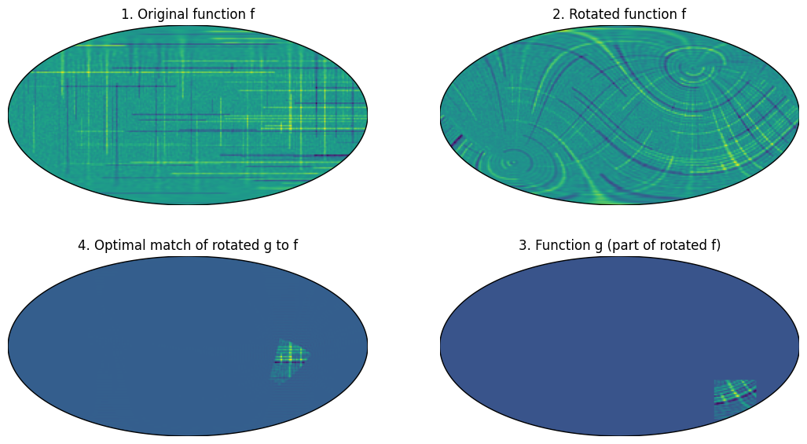
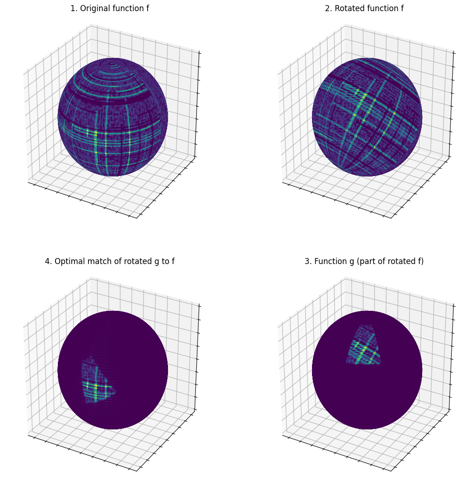

# Rotational cross-correlation
## Introduction
PySOFFT allows you to efficiently compute the rotational correlations between two functions over a sphere given by their spherical harmonic coefficients. This can be if you want to find out the optimal rotation that matches one function to the other.  

So consider the two fuctions:

$$ \begin{aligned} f: S^2 &\longrightarrow \mathbb{C}\\ g: S^2 &\longrightarrow \mathbb{C}\\ \end{aligned} $$

What we want to compute is:

$$ C(g) = \int_{S^2} d\omega f(\omega) g(R_g \omega)^* $$ 

where $g\in \mathrm{SO}(3)$ is a rotation, $\omega\in S^2$ is a point on the sphere and $R_g \omega$ is the resulting point on $S²$ when $\omega$ is rotated by $g$. The function $|C(g)|$ is maximal for the rotation $g$ that leads to the best overlap between $f$ and $g\circ R_g$ (the rotated version of $g$). The trick is now that we can compute $C(g)$ for many rotations at once since its Wigner coefficients are given by

$$C^l_{m,n}=f^l_m (g^l_n)^*(-1)^{m-n}$$

where $f^l_m$ and $g^l_m$ are [spherical harmonic coefficients](https://en.wikipedia.org/wiki/Spherical_harmonics#Spherical_harmonics_expansion){target="_blank"} of $f$ and $g$, respectively.  
For more details have a look at [FFTs on the rotation group](https://www.cs.jhu.edu/~misha/ReadingSeminar/Papers/Kostelec08.pdf){target="_blank"}.

## Example
For the following code to run we need a few more python packages:

 * [shtns](https://nschaeff.bitbucket.io/shtns/){target="_blank"} For computing spherical harmonic coefficients
 * [matplotlib](https://matplotlib.org/stable/){target="_blank"} For plotting.
 * [basemap](https://matplotlib.org/basemap/stable/users/installation.html){target="_blank"} For plotting.
 
And ideally run the code in a [jupiter notebook](https://jupyter.org/){target="_blank"}, but you dont have to.
The example will generate two sets of images showing the same data once as 2D maps and then as 3D spheres.
<div class="grid" markdown>




</div>
/// example | Example code for `cross_correlation_ylm_real`
```py
from pysofft import Soft
import numpy as np
import shtns
import matplotlib.pyplot as plt
from mpl_toolkits import mplot3d
from matplotlib import cm
from mpl_toolkits.basemap import Basemap

bw = 128
s = Soft(bw)
sh = shtns.sht(bw-1) # Spherical harmonic transform instance
n_phi = 256 
n_theta = 128

# Setup grid for Spherical harmonic transform
sh.set_grid(polar_opt=0,flags=shtns.sht_gauss)
sh.set_grid(nlat=n_theta,nphi=n_phi,polar_opt=0,flags=shtns.sht_gauss)
phis=2*np.pi*np.arange(n_phi)/(n_phi*sh.mres)
thetas=np.arccos(sh.cos_theta)
phis, thetas = np.meshgrid(phis, thetas)

# Cartesian coordinates of the unit sphere
x = np.sin(thetas) * np.cos(phis)
y = np.sin(thetas) * np.sin(phis)
z = np.cos(thetas)

# Setup first function over the sphere
np.random.seed(12345)
f = np.zeros((n_theta,n_phi),dtype=float)
for i in range(100):
    xid = (np.random.rand(3)*n_theta).astype(int)
    yid = (np.random.rand(3)*n_phi).astype(int)
    f[xid[0],yid[1]:yid[1]+yid[2]]+=np.random.rand()-0.5
    f[xid[1]:xid[1]+xid[2],yid[0]]+=np.random.rand()-0.5
f += np.random.rand(n_theta,n_phi)*0.2
# Make sure f is limited to the correct spherical harmonic bandwidth 
f = sh.synth(sh.analys(f)) 

# Create second function g by rotating f and selecting a patch
flm = sh.analys(f)
a_id,b_id,g_id = 203,61,52
a = s.euler_angles['alpha'][a_id]
b = s.euler_angles['beta'][b_id]
g = s.euler_angles['gamma'][g_id]
flm_rot = s.rotate_ylm_real(flm,(a,b,g))
f_rot = sh.synth(flm_rot)
# Select patch
g = np.zeros_like(f_rot)
g[10:40,195:225] = f_rot[10:40,195:225]
glm = sh.analys(g)

# Find optimal rotation to align g to f.
corr = s.cross_correlation_ylm_real(flm,glm)
argmax = np.argmax(np.abs(corr.T))
# Retrieve the found rotation
# The unraveled index has the format beta,alpha,gamma
found_rot_ids = np.unravel_index(argmax,corr.shape)
found_rot_ids = np.array((found_rot_ids[1],found_rot_ids[0],found_rot_ids[2]))
print(f'True rotation ids  (alpha_id,beta_id,gamma_id)={np.array((a_id,b_id,g_id))}')
print(f'Found rotation ids (alpha_id,beta_id,gamma_id)={found_rot_ids}')

# Apply reverse rotation on g
af = s.euler_angles['alpha'][found_rot_ids[0]]
bf = s.euler_angles['beta'][found_rot_ids[1]]
gf = s.euler_angles['gamma'][found_rot_ids[2]]
glm2 = s.rotate_ylm_real(glm,(-gf,-bf,-af))
g2 = sh.synth(glm2)

# Plot in 2D
fig,axs = plt.subplots(2,2,figsize=(13,7))
m1 = Basemap(projection='moll',lon_0=0,resolution='c',ax=axs[0,0])
m2 = Basemap(projection='moll',lon_0=0,resolution='c',ax=axs[0,1])
m3 = Basemap(projection='moll',lon_0=0,resolution='c',ax=axs[1,1])
m4 = Basemap(projection='moll',lon_0=0,resolution='c',ax=axs[1,0])
m1.imshow(f)
m2.imshow(f_rot)
m3.imshow(g)
m4.imshow(g2)
axs[0,0].set_title('1. Original function f')
axs[0,1].set_title('2. Rotated function f')
axs[1,1].set_title('3. Function g (part of rotated f)')
axs[1,0].set_title('4. Optimal match of rotated g to f')
plt.show()

# If you are executing this code not in jupyter lab but from a python console
# a window will open that shows the Figure, The code will continue when you close the window.

# Plot in 3D
fig = plt.figure(figsize=(13,13))
ax1 = fig.add_subplot(2, 2, 1, projection='3d',aspect='equal')
ax2 = fig.add_subplot(2, 2, 2, projection='3d',aspect='equal')
ax3 = fig.add_subplot(2, 2, 3, projection='3d',aspect='equal')
ax4 = fig.add_subplot(2, 2, 4, projection='3d',aspect='equal')
for a in [ax1,ax2,ax3,ax4]:
    a.set_xticklabels([])
    a.set_zticklabels([])
    a.set_yticklabels([])
ax1.plot_surface(x, y, z, rstride=1, cstride=1,facecolors=cm.viridis(f),shade=False)
ax1.set_title('1. Original function f')
ax2.plot_surface(x, y, z, rstride=1, cstride=1,facecolors=cm.viridis(f_rot),shade=False)
ax2.set_title('2. Rotated function f')
ax3.plot_surface(x, y, z, rstride=1, cstride=1,facecolors=cm.viridis(g2),shade=False)
ax3.set_title('4. Optimal match of rotated g to f')
ax4.plot_surface(x, y, z, rstride=1, cstride=1,facecolors=cm.viridis(g),shade=False)
ax4.set_title('3. Function g (part of rotated f)')
plt.show()
```
///

/// example | Example Code for `cross_correlation_ylm_cmplx`
```py
from pysofft import Soft
import numpy as np
import shtns
import matplotlib.pyplot as plt
from mpl_toolkits import mplot3d
from matplotlib import cm
from mpl_toolkits.basemap import Basemap

bw = 128
s = Soft(bw)
sh = shtns.sht(bw-1) # Spherical harmonic transform instance
n_phi = 256 
n_theta = 128

# Setup grid for Spherical harmonic transform
sh.set_grid(polar_opt=0,flags=shtns.sht_gauss)
sh.set_grid(nlat=n_theta,nphi=n_phi,polar_opt=0,flags=shtns.sht_gauss)
phis=2*np.pi*np.arange(n_phi)/(n_phi*sh.mres)
thetas=np.arccos(sh.cos_theta)
phis, thetas = np.meshgrid(phis, thetas)

# Cartesian coordinates of the unit sphere
x = np.sin(thetas) * np.cos(phis)
y = np.sin(thetas) * np.sin(phis)
z = np.cos(thetas)

# Setup first function over the sphere
np.random.seed(12345)
f = np.zeros((n_theta,n_phi),dtype=complex)
for i in range(100):
    xid = (np.random.rand(3)*n_theta).astype(int)
    yid = (np.random.rand(3)*n_phi).astype(int)
    f[xid[0],yid[1]:yid[1]+yid[2]]+=np.random.rand()-0.5
    f[xid[1]:xid[1]+xid[2],yid[0]]+=np.random.rand()-0.5
f += np.random.rand(n_theta,n_phi)*0.2
# Make sure f is limited to the correct spherical harmonic bandwidth 
f = sh.synth_cplx(sh.analys_cplx(f)) 

# Create second function g by rotating f and selecting a patch
flm = sh.analys_cplx(f)
a_id,b_id,g_id = 203,61,52
a = s.euler_angles['alpha'][a_id]
b = s.euler_angles['beta'][b_id]
g = s.euler_angles['gamma'][g_id]
flm_rot = s.rotate_ylm_cmplx(flm,(a,b,g))
f_rot = sh.synth_cplx(flm_rot)
# Select patch
g = np.zeros_like(f_rot)
g[10:40,195:225] = f_rot[10:40,195:225]
glm = sh.analys_cplx(g)

# Find optimal rotation to align g to f.
corr = s.cross_correlation_ylm_cmplx(flm,glm)
argmax = np.argmax(np.abs(corr.T))
# Retrieve the found rotation
# The unraveled index has the format beta,alpha,gamma
found_rot_ids = np.unravel_index(argmax,corr.shape)
found_rot_ids = np.array((found_rot_ids[1],found_rot_ids[0],found_rot_ids[2]))
print(f'True rotation ids  (alpha_id,beta_id,gamma_id)={np.array((a_id,b_id,g_id))}')
print(f'Found rotation ids (alpha_id,beta_id,gamma_id)={found_rot_ids}')

# Apply reverse rotation on g
af = s.euler_angles['alpha'][found_rot_ids[0]]
bf = s.euler_angles['beta'][found_rot_ids[1]]
gf = s.euler_angles['gamma'][found_rot_ids[2]]
glm2 = s.rotate_ylm_cmplx(glm,(-gf,-bf,-af))
g2 = sh.synth_cplx(glm2)

# Plot in 2D
fig,axs = plt.subplots(2,2,figsize=(13,7))
m1 = Basemap(projection='moll',lon_0=0,resolution='c',ax=axs[0,0])
m2 = Basemap(projection='moll',lon_0=0,resolution='c',ax=axs[0,1])
m3 = Basemap(projection='moll',lon_0=0,resolution='c',ax=axs[1,1])
m4 = Basemap(projection='moll',lon_0=0,resolution='c',ax=axs[1,0])
m1.imshow(f.real)
m2.imshow(f_rot.real)
m3.imshow(g.real)
m4.imshow(g2.real)
axs[0,0].set_title('1. Original function f')
axs[0,1].set_title('2. Rotated function f')
axs[1,1].set_title('3. Function g (part of rotated f)')
axs[1,0].set_title('4. Optimal match of rotated g to f')
plt.show()

# If you are executing this code not in jupyter lab but from a python console
# a window will open that shows the Figure, The code will continue when you close the window.

# Plot in 3D
fig = plt.figure(figsize=(13,13))
ax1 = fig.add_subplot(2, 2, 1, projection='3d',aspect='equal')
ax2 = fig.add_subplot(2, 2, 2, projection='3d',aspect='equal')
ax3 = fig.add_subplot(2, 2, 3, projection='3d',aspect='equal')
ax4 = fig.add_subplot(2, 2, 4, projection='3d',aspect='equal')
for a in [ax1,ax2,ax3,ax4]:
    a.set_xticklabels([])
    a.set_zticklabels([])
    a.set_yticklabels([])
ax1.plot_surface(x, y, z, rstride=1, cstride=1,facecolors=cm.viridis(f.real),shade=False)
ax1.set_title('1. Original function f')
ax2.plot_surface(x, y, z, rstride=1, cstride=1,facecolors=cm.viridis(f_rot.real),shade=False)
ax2.set_title('2. Rotated function f')
ax3.plot_surface(x, y, z, rstride=1, cstride=1,facecolors=cm.viridis(g2.real),shade=False)
ax3.set_title('4. Optimal match of rotated g to f')
ax4.plot_surface(x, y, z, rstride=1, cstride=1,facecolors=cm.viridis(g.real),shade=False)
ax4.set_title('3. Function g (part of rotated f)')
plt.show()
```
///
